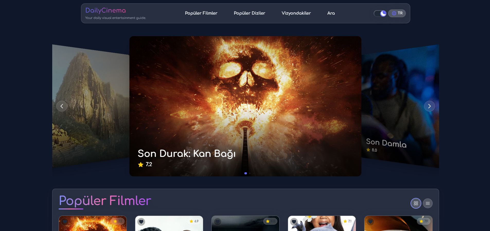

# DailyCinema

## Kısa Tanım ve Amaç
DailyCinema, modern ve görsel açıdan zengin bir film/dizi rehberi uygulamasıdır. Kullanıcılar, popüler filmleri ve dizileri keşfedebilir, detaylarına ulaşabilir, filtreleme ve arama yapabilir, favorilerini işaretleyebilir ve çoklu dil/tema desteğiyle kişiselleştirilmiş bir deneyim yaşayabilir.

## Kullanılan Teknolojiler
- React 19
- Vite
- TailwindCSS (özel tema ve glassmorphism)
- TMDB API
- i18next (TR/EN çoklu dil)
- react-router-dom
- framer-motion (animasyonlar)
- Heroicons & react-icons
- dotenv (API anahtarı yönetimi)
- LocalStorage (favoriler, görünüm, tema)

## Ekran Görüntüsü


Yukarıda DailyCinema arayüzüne ait örnek bir ekran görüntüsü yer almaktadır.

## Kurulum
```bash
git clone https://github.com/kullanici/daily-cinema.git
cd daily-cinema
npm install
````

### Ortam Değişkenleri (.env)

Bu uygulamanın çalışabilmesi için bir TMDB API anahtarına ihtiyaç vardır. Anahtarınızı almak ve yapılandırmak için şu adımları izleyin:

1. [TMDB API](https://developer.themoviedb.org/docs/getting-started) sayfasına gidin ve bir hesap oluşturun.
2. API Key oluşturun (v3 önerilir).
3. Proje kök dizininde bir `.env` dosyası oluşturun ve aşağıdaki satırı içine yazın:

```env
VITE_TMDB_API_KEY=your_tmdb_api_key_here
```

> **Not:** `.env` dosyası güvenlik amacıyla `.gitignore` dosyasına eklenmiştir ve GitHub gibi platformlara yüklenmemelidir.

4. Ardından uygulamayı başlatın:

```bash
npm run dev
```

## Özellikler

* Popüler filmler ve diziler
* Grid ↔ Liste görünüm geçişi (modern kartlar)
* Çoklu dil desteği (Türkçe/İngilizce)
* Tema geçişi (Light/Dark, glassmorphism)
* TMDB API ile gerçek zamanlı içerik
* Arama ve gelişmiş filtreleme (puan, yıl, tür)
* Favorilere ekleme (localStorage)
* Responsive ve modern UI/UX
* Scroll-to-top, özel scrollbar, animasyonlar

## API ve TMDB Atıfı

Bu uygulama [TMDB API](https://www.themoviedb.org/) verilerini kullanır. TMDB markası ve logosu bu proje ile ilişkili değildir.

## Geliştirici

Harzem Umut Yıldız
[LinkedIn](https://www.linkedin.com/in/harzem-umut-y%C4%B1ld%C4%B1z-2356801b7/) • [GitHub](https://github.com/HarzemYldz)

## Lisans

MIT


